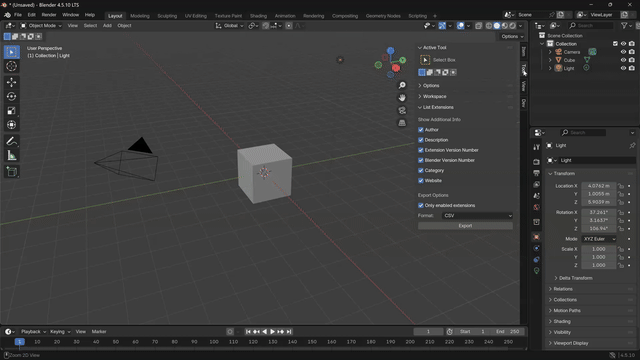

## List Blender Extensions

Blender add-on that generates list of installed extensions.

Supported formats:
- Text
- CSV
- JSON

## Installation

1. Download the latest `list_blender_extensions-x.x.x.zip` from the [Releases page](https://github.com/Wooniety/List-Blender-Extensions/releases).
2. Open Blender and select Edit -> Preferences
3. Click "Add-ons" tab and then "Install Add-on from File"
4. Select the downloaded list_blender_extensions-1.0.0.zip file
5. Check the 'List Blender Extensions' option in the add-ons dialog

## Usage
1. In the 3D Viewport, open the sidebar by pressing **N**.
2. Select the **Tool** tab and find the **List Extensions** panel.
3. Under **Show Additional Info**, tick the details you want included for each extension.
4. Under **Export Options**, choose whether to list only enabled extensions and pick your export format.
5. Click **Export**. Choose a folder and filename in the file browser, then confirm. The file is written to the location you selected.

